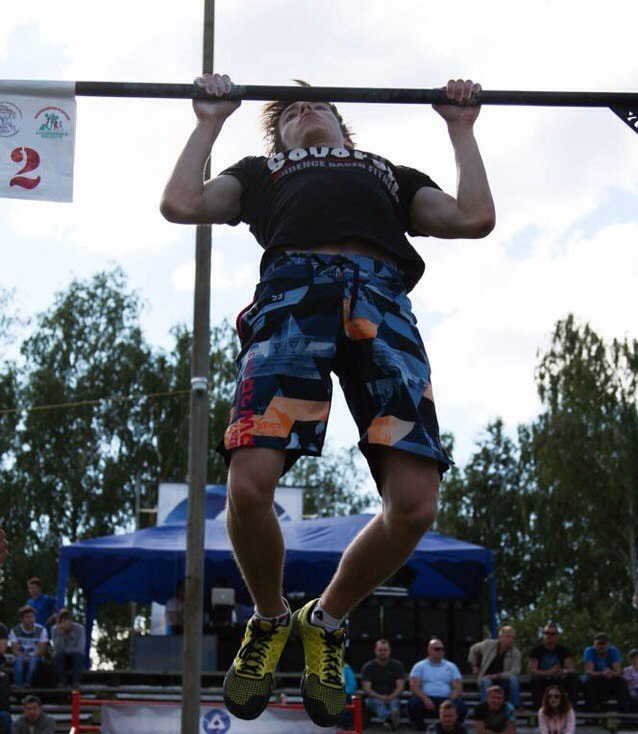

<html>
<head>
<meta name="viewport" content="width=device-width, minimum-scale=1.0" />
<title>Кирилл Кочетков. If you are reading this it's too late.</title>
</head>

<body background="wood _texture2.jpg" tracingsrc="wood _texture2.jpg" tracingopacity="100">

  

    <ul class="nav">
      <li><a class="navigation" href="#aboutme">Обо мне</a></li>
      <li><a class="navigation" href="#HardSkills">Hard Skills</a></li>
      <li><a class="navigation" href="#SoftSkills">Soft Skills</a></li>
      <li><a class="navigation" href="#photos">Мои фотографии</a></li>
      <li><a class="navigation" href="#career">Карьера</a></li>
      <li><a class="navigation" href="#myfavvideo">Мой любимый музыкальный клип</a></li>
    
 Focus on the inner me, never on the enemy. (Big Sean)

	    
 Click me to check my 1st HomeWork 

	    <button onclick="myFunction()">Check it</button>

I am Kirill's HW
	    

	  
</ul>
  <!-- end .sidebar1 -->

  

  <section id="aboutme">
    <h1>Обо мне</h1>
    
Меня зовут Кирилл Кочетков и мне 22 года. Я являюсь Junior QA Engineer в компании Antida Software. Также, как вы уже поняли, я являюсь одним из кандидатов на попадание в состав Frontend School от компании Antida Software.
  
 
Мое знакомство с АйТи сферой началось в далеком 2013 году, когда я прошел онлайн-курсы по написанию кода на PHP. Тогда я создал свой первый веб-сайт, который был связан со спортивной тематикой. В 2014 году я ознакомился с такими CMS как WordPress и Joomla, что также внесло свой вклад в моё развитие. После длительного перерыва, в 2019 я "ворвался" в АйТи сферу и хочу не отставать от развития данной сферы.

<section id="HardSkills">
    <h2>Hard Skills</h2>
    <ol>
      <li>PHP (Intermediate)</li>
      <li>JavaScript (codeacademy lessons are in progress) </li>
      <li>HTML and CSS (Intermediate) </li>
      <li>MySQL (Basic)</li>
      <li>Experience of working with WordPress and Joomla CMS 
      </li>
    </ol>
    <dl>
      <dt>&nbsp; </dt>
    </dl>
    <section id="SoftSkills">
    <h2><strong>Soft Skills</strong></h2>
    <ol>
      <li>English language(Upper-Intermediate);</li>
      <li>Spanish language (Basic);</li>
      <li>Внимательность к деталям;</li>
      <li>Стрессоустойчивость;</li>
      <li>Высокий уровень обучаемости. 
      </li>
    </ol>
    <section id="photos">
    <h2>Мои фотографии</h2>
    
 

<section id="career">
    <h2>Карьера</h2>
    
Моя карьера еще скромная и достаточно тривиальна. Я только начал свою карьеру. Когда о ней будет что рассказать, то этот текст будет больше.

    <section id="myfavvideo">
    <h2>Мой любимый музыкальный клип</h2>
    
<iframe width="560" height="315" src="https://www.youtube.com/embed/tvTRZJ-4EyI" frameborder="0" allow="accelerometer; autoplay; encrypted-media; gyroscope; picture-in-picture" allowfullscreen></iframe> 

<h2>Мои социальные сети</h2>

    

